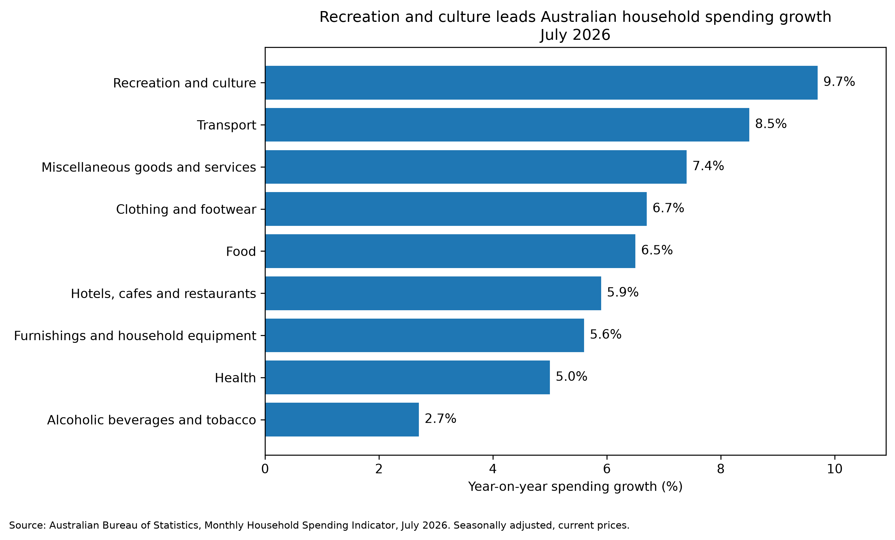
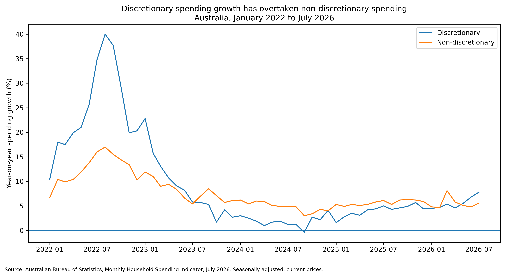
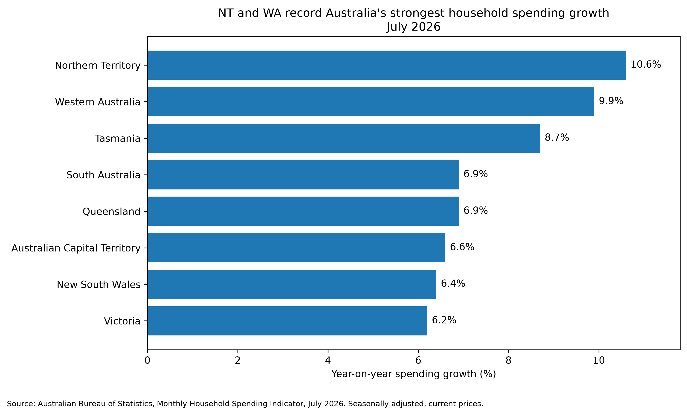

# Australian Household Spending Data Story

## Overview

This project analyses Australian Bureau of Statistics household spending data to identify trends that could be developed into media and Digital PR stories.

The aim was to take a large public dataset, clean and analyse it using Python, identify meaningful patterns, and translate those findings into clear and potentially newsworthy angles.

## Key Findings

### 1. Recreation and culture leads household spending growth

In July 2026, recreation and culture recorded the strongest year-on-year household spending growth among the major spending categories analysed, increasing by 9.7%.

Transport followed at 8.5%, while miscellaneous goods and services increased by 7.4%.



### 2. Discretionary spending growth has overtaken non-discretionary spending

Discretionary household spending increased by 7.8% year-on-year in July 2026, compared with 5.6% growth in non-discretionary spending.

The longer-term trend shows discretionary spending growth accelerating through 2026 after generally trailing non-discretionary spending during much of 2023 to 2025.



### 3. Northern Territory and Western Australia lead spending growth

Household spending growth varied considerably across Australia.

In July 2026:

- Northern Territory: 10.6%
- Western Australia: 9.9%
- Tasmania: 8.7%
- Queensland: 6.9%
- South Australia: 6.9%
- Australian Capital Territory: 6.6%
- New South Wales: 6.4%
- Victoria: 6.2%



## Potential Media Angles

### Australians increase discretionary spending as recreation leads growth

Discretionary spending growth reached 7.8% year-on-year in July 2026, compared with 5.6% for non-discretionary spending.

At the category level, recreation and culture recorded the strongest growth at 9.7%.

This could support a broader consumer or lifestyle story around changing household spending patterns.

### NT and WA record Australia's strongest household spending growth

Northern Territory household spending increased 10.6% year-on-year, followed by Western Australia at 9.9%.

Both substantially exceeded growth in Australia's two largest states, New South Wales and Victoria.

This creates a potential regional economic or consumer spending story.

### Recreation spending outpaces food, hospitality and health

Recreation and culture spending increased 9.7% year-on-year, compared with:

- Food: 6.5%
- Hotels, cafes and restaurants: 5.9%
- Health: 5.0%

This provides another potential lifestyle and consumer behaviour angle.

## Methodology

The analysis uses the Australian Bureau of Statistics Monthly Household Spending Indicator.

The project:

1. Loaded 10 ABS household spending Excel datasets.
2. Extracted the seasonally adjusted series.
3. Cleaned and combined national, category and state-level data using Python and pandas.
4. Analysed year-on-year spending growth.
5. Compared spending categories, discretionary versus non-discretionary spending, and Australian states and territories.
6. Created visualisations using matplotlib.
7. Identified potential media and Digital PR angles from the findings.

## Important Limitation

The ABS Household Spending Indicator is measured at current prices.

Therefore, increases in spending may reflect changes in prices, quantities purchased, or both.

The results should not be interpreted as showing an equivalent increase in the physical volume of goods or services consumed.

## Tools

- Python
- pandas
- matplotlib
- openpyxl
- Excel
- Git/GitHub

## Project Structure

```text
Australian-Household-Spending-Data-Story/
│
├── data/
│   ├── raw/
│   └── processed/
│
├── outputs/
│   └── charts/
│
├── SRC/
│   ├── inspect_data.py
│   ├── analysis.py
│   └── charts.py
│
└── README.md